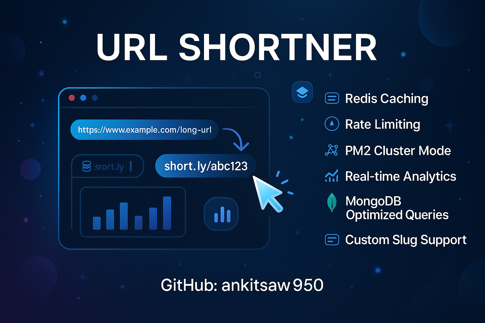

---



##   `URL Shortener – Project Documentation` 

This document explains the entire development process of the URL Shortener backend up to implementing Redis caching. It covers folder setup, controller design, adding custom slugs, identifying race conditions, optimizing MongoDB usage, improving query performance with `.lean()`, and integrating Redis for high-speed redirects.

---

#  **1. Project Setup**

## **Folder Structure**

We follow a clean modular structure:

```
project/
│
├── src/
│   ├── controllers/
│   ├── models/
│   ├── routes/
│   ├── config/
│   └── utils/
│
├── server.js
└── package.json
```

### **Key Files**

* `controllers/url.controller.js` → Create + Redirect logic
* `models/url.model.js` → URL schema
* `routes/url.routes.js` → Routing
* `config/db.js` → MongoDB connection
* `config/redis.js` → Redis caching

---

#  **2. Basic URL Controller Setup**

We start by creating two main controllers:

## ✔ **createUrl**

* Accepts long URL from request body.
* Generates a short code.
* Stores mapping in MongoDB.

## ✔ **redirectUrl**

* Looks up the short code.
* Redirects user to original URL.

---

#  **3. Adding Feature: Custom Slug**

Users should be able to specify their own custom code instead of a randomly generated one.

### **Naive Implementation (Problematic)**

``` js
if (customCode) {
  const existingUrl = await URL.findOne({ short_url: customCode });
  if (existingUrl) {
    return res.status(400).json({ message: "Custom code already exists" });
  }
} 

```

###  **Why This Approach is Bad**

This creates a **race condition**:

### ⚠ Scenario:

Two users send the **same** custom slug at the **same time**.

1. **Both run `findOne()`**
2. Both get: *"slug does not exist"*
3. Both run `URL.create()`
4. One succeeds, one fails → inconsistent behavior

###  Additional Issues

* Performs **one extra DB read every time** user sends a custom code
  → Slows down API
* Does not trust MongoDB’s **unique index**
* Not scalable when multiple server instances run

---

#  **4. Solution: Use Unique Index + Catch Duplicate Error**

MongoDB ensures uniqueness.
We **remove manual checking** and **let DB enforce uniqueness**.

### New approach:

* Try inserting directly.
* If slug already exists → Mongo throws error code: `11000`
* Catch and handle cleanly.

This avoids race conditions and eliminates unnecessary DB reads.

---

#  **5. Validating URL Format**

Earlier, no format validations were present.

Now we add:

```js
try {
  const normalizedUrl = new URL(url).href;
} catch {
  return res.status(400).json({ message: "Invalid URL" });
}
```

### Why is this important?

* Ensures only valid URLs (http/https) are stored
* Prevents storing invalid or malicious URLs
* Normalizes URL
  Example: removes unnecessary characters and ensures consistent format

---

#  **6. Redirect Logic Optimization with `.lean()`**

Initial redirect logic:

```js
const url = await URL.findOne({ short_url: code });
```

###  Problem:

Returns a **full Mongoose document**, which includes:

* internal metadata
* getters/setters
* prototype chain
* virtuals

This is unnecessary for a simple redirect.

---

### ✔ Optimized version:

```js
const url = await URL.findOne({ short_url: code }).lean();
```

### Benefits of `.lean()`:

* Returns **plain JS object**
* **3x to 10x faster**
* Less memory usage
* Perfect for high-frequency redirect endpoint

---

#  **7. Adding Redis Caching (Major Optimization)**

Redirect route is the **most frequently hit** part of any URL shortener.

To handle thousands/millions of redirects efficiently, we add **Redis caching**.

---

#  **Caching Strategy (Cache-Aside Pattern)**

### **Flow:**

```
1️⃣ Check Redis cache using short code
                ↓
2️⃣ If found → redirect immediately (<2ms)
                ↓
3️⃣ If NOT found → query MongoDB
                ↓
4️⃣ Save result to Redis for future use
                ↓
5️⃣ Redirect user to original URL
```

### Why this is important?

* Removes 80–95% of DB load
* Makes redirect almost instantaneous
* Scales well across multiple servers
* Boosts performance dramatically

---

#  **Redis-Powered Redirect Code**

```js
// STEP 1 : Check the redis cache first
const cachekey = `short:${code}`;
const cachedUrl = await redisClient.get(cachekey);

if (cachedUrl) {
  console.log("🟢 Redis cache hit");
  return res.redirect(cachedUrl);
}

console.log("🟠 Redis cache miss");

// STEP 2 : Check the DB
const url = await UrlModel.findOne(
  { short_url: code },
  { full_url: 1, _id: 0 }
)
  .lean()
  .exec();

if (!url) return res.status(404).json({ message: "URL not found" });

// STEP 3 : Add to the redis cache
await redisClient.set(cachekey, url.full_url, { EX: 60 * 60 });

return res.redirect(url.full_url);
```

---

#  **Redis Cache Hit / Miss Behavior**

### First request:

```
🟠 Redis cache miss
```

* MongoDB is queried
* Redis is updated
* Redirect happens

### Next requests:

```
🟢 Redis cache hit
```

* Served instantly from Redis
* No database query

---
---

#  **8. Adding Analytics Features (Basic + Intermediate Tracking)**

A URL Shortener is incomplete without analytics. Users want to know:

* How many times the link was clicked
* When it was first clicked
* When it was last clicked
* What devices people used
* Which browsers visited
* Which OS they came from
* Visitor IP
* Referrer (direct, social media, etc.)

To enable this **without stressing MongoDB**, we store analytics in **Redis**.

We use two layers:

---

#  **8.1. Basic Analytics (Lightweight)**

Stored using **INCR** and **SET** in Redis.

### **Keys Used**

| Key                       | Meaning               |
| ------------------------- | --------------------- |
| `stats:count:<code>`      | Total clicks          |
| `stats:firstClick:<code>` | First click timestamp |
| `stats:lastClick:<code>`  | Last click timestamp  |

### **How it works**

Every time user hits redirect:

```
1️⃣ Increase click count  
2️⃣ Update last click  
3️⃣ Set first click only the first time
```

### **Code Used**

```js
export const recordBasicAnalytics = async (code) => {
  try {
    const countKey = `stats:count:${code}`;
    const lastkey = `stats:lastClick:${code}`;
    const firstKey = `stats:firstClick:${code}`;

    const time = Date.now();

    redisClient.incr(countKey).catch(() => {});
    redisClient.set(lastkey, time).catch(() => {});
    redisClient.set(firstKey, time, { NX: true }).catch(() => {});
  } catch (error) {
    console.error("Analytics Error:", err.message);
  }
};
```

---

#  **8.2. Intermediate Analytics (Detailed Logs)**

We use the following:

* IP Address
* Browser name
* OS
* Device type
* Referrer
* Accurate timestamp

We use **UAParser** to extract device + OS + browser.

### **Data is stored inside a Redis List (LPUSH)**

* Key example: `stats:logs:hello`
* We store max **200 entries** per URL (using LTRIM)

### **Code Used**

```js
export const recordIntermediateAnalytics = async (req, code) => {
  try {
    const parser = new UAParser(req.headers["user-agent"]);
    const uaResult = parser.getResult();

    const ip =
      req.headers["x-forwarded-for"] || req.socket.remoteAddress || "unkown";

    const referrer = req.headers["referrer"] || "direct";

    const logData = {
      timeStamp: Date.now(),
      ip,
      browser: uaResult.browser.name || "Unknown",
      os: uaResult.os.name || "Unknown",
      device: uaResult.device.type || "desktop",
      referrer,
    };

    await redisClient.LPUSH(`stats:logs:${code}`, JSON.stringify(logData));
    await redisClient.LTRIM(`stats:logs:${code}`, 0, 199); // Keep latest 200 entries
  } catch (error) {
    console.error("Intermediate Analytics Error:", error);
  }
};
```

### **Benefits**

* No database pressure
* Fast read/write
* Shows real-time analytics
* Works perfectly in high traffic scenarios

---

#  **9. Rate Limiting with Redis**

We now prevent users from hitting API too many times in a small time window.

### **Why rate limiting?**

* Protects from DDoS
* Avoids brute-force attacks on slugs
* Prevents API abuse
* Avoids server overload

### **Strategy: Token Bucket using Redis**

Every request:

* `rate:<ip>` counter increments
* If first request → assign expiry (e.g., 60 seconds)
* If count exceeds limit → block

### **Code Used**

```js
const rateLimiter = (limit = 50, windowSec = 60) => {
  return async (req, res, next) => {
    try {
      const ip =
        req.headers["x-forwarded-for"] || req.socket.remoteAddress || "unkown";

      const key = `rate:${ip}`;

      const current = await redisClient.incr(key);

      if (current === 1) {
        await redisClient.expire(key, windowSec);
      }

      if (current > limit) {
        return res.status(429).json({ message: "Too many requests" });
      }

      next();
    } catch (error) {
      console.error("Rate Limiter Error:", error);
      next();
    }
  };
};

export default rateLimiter;
```

### **Where is it used?**

Usually added to:

* URL creation API
* Analytics API
* Admin routes

We **do NOT** add rate limit on redirect route (redirect must stay ultra-fast).

---

#  **10. PM2 Cluster Mode for Load Balancing**

Once the app becomes production-ready, we run it in **multi-core mode** using PM2.

PM2 cluster mode:

* Uses **all CPU cores**
* Creates multiple Node.js processes
* Automatically load-balances requests
* Gives zero downtime restarts
* Handles crashes automatically

### **Why do we need cluster mode?**

Because:

* Node.js is single-threaded
* Redirect routes are extremely high traffic
* One process can get overloaded

PM2 helps distribute load across **all cores**, e.g.,

| CPU Cores | PM2 Instances |
| --------- | ------------- |
| 2         | 2             |
| 4         | 4             |
| 8         | 8             |

### **Command**

```
pm2 start server.js -i max
```

PM2 will:

* Spawn as many workers as CPU cores
* Internally acts as a **load balancer**
* Redis cache lets all workers share same cache

### **Why Redis is important here?**

Because when using clustering:

* 4 or 8 different Node.js processes may serve requests
* But **all share the same Redis memory**
* Cache remains consistent
* Rate limiting works
* Analytics works correctly
* No conflicts or race conditions

---

