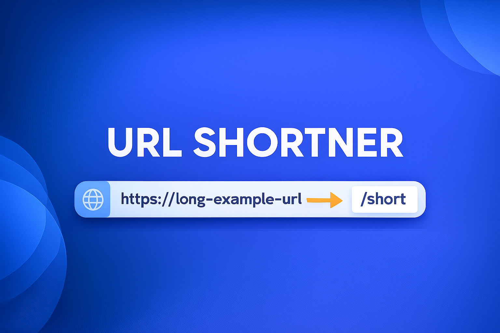

---

#  `URL Shortener` 



This section explains **how to use the URL Shortener backend in a real environment**.
It covers setup, configuration, API usage, analytics retrieval, and production deployment.

---

#  **1. Requirements**

### **System Requirements**

| Component      | Version |
| -------------- | ------- |
| Node.js        | v18+    |
| MongoDB        | v5+     |
| Redis          | v6+     |
| PM2 (optional) | v5+     |

### **Dependencies Installed**

```
express, mongoose, nanoid, redis, ua-parser-js, dotenv, cors
```

---

#  **2. How to Start the Project**

### **Step 1 — Clone the Repository**

```bash
git clone  https://github.com/ankitsaw950/URL-SHORTNER
cd Backend
```

### **Step 2 — Install Dependencies**

```bash
npm install
```

### **Step 3 — Configure Environment Variables**

Create a `.env` file:

```
PORT=5000
MONGO_URL=mongodb://localhost:27017/shortener
REDIS_URL=redis://localhost:6379
BASE_URL=http://localhost:5000
```

### **Step 4 — Start the Server**

```bash
npm run dev
```

Your backend is now running at:

```
http://localhost:5000
```

---

# 🔗 **3. API Usage Guide**

This system exposes **two main endpoints**:

---

#  **3.1 Create Short URL**

### **POST** `/api/url`

### **Request Body**

```json
{
  "url": "https://example.com",
  "customCode": "ankit123"
}
```

### **Response**

```json
{
  "message": "URL created successfully",
  "shortURL": "http://localhost:5000/ankit123",
  "shortCode": "ankit123"
}
```

### **Notes**

✔ `customCode` is optional

✔ If omitted → nanoid(6) generates a random slug

✔ If slug already exists → system returns error (handled via DB unique index)

---

#  **3.2 Redirect URL**

### **GET** `/:code`

Example:

```
GET http://localhost:5000/ankit123
```

### **Flow**

1. System checks Redis cache
2. If not found, loads from MongoDB
3. Updates cache (1 hour by default)
4. Redirects user instantly

---

#  **4. Analytics Usage**

Analytics are stored in Redis and can be accessed via separate API (you can expose these as needed).

---

## **4.1 Basic Analytics Keys**

| Key                       | Description               |
| ------------------------- | ------------------------- |
| `stats:count:<code>`      | Total number of clicks    |
| `stats:firstClick:<code>` | Timestamp of first click  |
| `stats:lastClick:<code>`  | Timestamp of latest click |

##### Example (Redis CLI):

```bash
GET stats:count:ankit123
```

---

## **4.2 Detailed Logs**

| Key                 | Description                                               |
| ------------------- | --------------------------------------------------------- |
| `stats:logs:<code>` | Latest 200 visit logs (IP, browser, OS, device, referrer) |

##### Example (Redis CLI):

```bash
LRANGE stats:logs:ankit123 0 10
```

This returns items like:

```json
{
  "timeStamp": 1730029938821,
  "ip": "::1",
  "browser": "Chrome",
  "os": "Windows",
  "device": "desktop",
  "referrer": "direct"
}
```

---

#  **5. Rate Limiting (How It Works for Users)**

Rate limiting is automatically applied based on **IP address**.

Default:

* 50 requests per minute per IP.

If exceeded:

```
429 — Too Many Requests
```

This helps prevent:

* Misuse of URL creation API
* Brute-force slug attacks
* Server overload

---

#  **6. Project Folder Structure (Reference)**

```
src/
├── controllers/
│   └── url.controller.js
├── models/
│   └── url.model.js
├── routes/
│   └── url.routes.js
├── utils/
│   └── analytics.js
├── config/
│   ├── db.js
│   └── redis.js
server.js
```

---

#  **7. Deployment Guide (Production)**

### **Step 1 — Install PM2**

```
npm install -g pm2
```

### **Step 2 — Run in Cluster Mode**

```
pm2 start server.js -i max
```

### Why cluster mode?

  ✔ Uses all available CPU cores

  ✔ Built-in load balancing

  ✔ Auto-restarts if app crashes

  ✔ Zero-downtime restarts

Redis ensures:

* Cache consistency
* Rate limiting consistency
* Analytics consistency

across all PM2 instances.


#  **10. How to Integrate With Any Frontend**

Your frontend (React, Next.js, mobile app, etc.) can call:

### **To create URL**

```javascript
await fetch("/api/url", {
  method: "POST",
  headers: { "Content-Type": "application/json" },
  body: JSON.stringify({ url, customCode })
});
```

### **To redirect**

Just open:

```
https://yourdomain.com/<shortCode>
```

### **To show analytics**

Use Redis data or create an API like:

```
GET /api/stats/:code
```

---


### 📄 Detailed Explanation  
👉 **[Open PROJECT_DOCUMENTATION.md](https://github.com/ankitsaw950/URL-SHORTNER/blob/main/PROJECT_DOCUMENTATION.md)**
